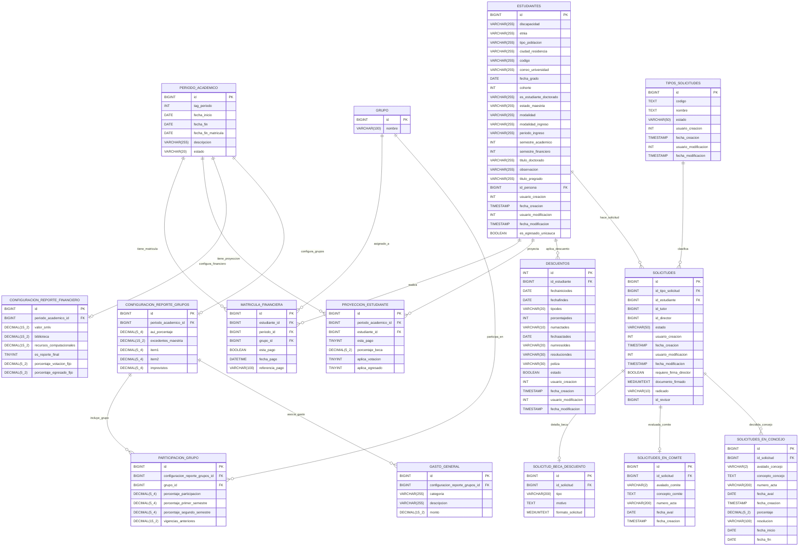

# Diagrama de Base de Datos (Complementado con all.sql)

El siguiente diagrama Entidad-Relación (ER) en Mermaid representa las tablas y relaciones para los módulos de **Información Presupuestaria** y **Matrícula Financiera**. Se han incluido absolutamente todos los campos (combinando las versiones base y las alteraciones/scripts posteriores) extraídos de `all.sql` para que ninguna información se pierda.

